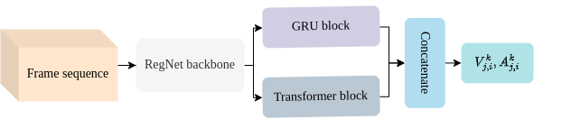
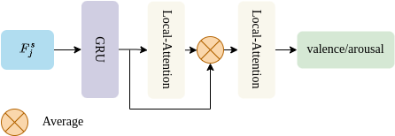
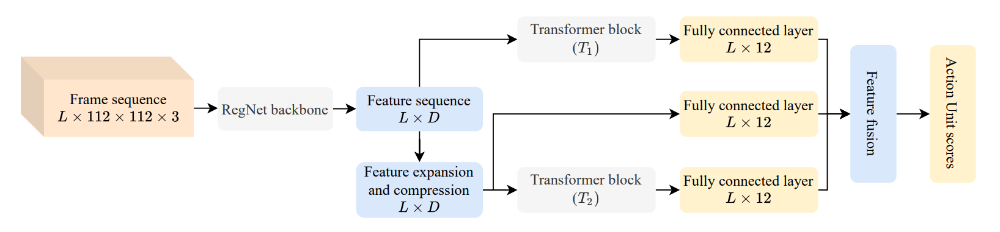

  
  ### Task 1: Valence-Arousal Estimation.
  
  **Feature extraction module: Valence-Arousal Predictor(VAP).**

  

  **Overview of prediction model: Gated Recurrent Unit combined with local attention.**

  

  ### Task 2: Action Unit Detection.
  
  **An overview of our action unit detection system.**

  
  
  

  Human emotions recognization contributes to the development of human-computer interaction. The machines understanding human emotions in the real world will significantly contribute to life in the future. This paper introduces the 3rd Affective Behavior Analysis in-the-wild (ABAW3) 2022 challenge. We focused on solving the problem of the Valence-Arousal (VA) estimation and Action Unit (AU) detection. For valence-arousal estimation, we conducted two stages: creating new features from multimodel and temporal learning to predict valence-arousal. First, we make new features; the Gated Recurrent Unit (GRU) and Transformer are combined using a Regular Networks (RegNet) feature, which is extracted from the image. The next step is the GRU combined with local attention to predict valencearousal. The Concordance Correlation Coefficient (CCC) was used to evaluate the model. The result achieved 0.450 for valence and 0.445 for arousal on the test set, outperforming the baseline method with a corresponding CCC of 0.180 for valence and 0.170 for arousal. We also performed additional experiments on the action unit task with simple transformer blocks.Our submission to ABAW3 2022 ranks 3rd for both tasks.

  **Input:**
  
  >Task 1: Videos of around 2.8M frames will be used that contain annotations in terms of valence and arousal.
  
  >Task 2: Videos of around 2.7M frames will be used that contain annotations in terms of 12 action units, namely AU1, AU2, AU4, AU6, AU7, AU10, AU12, AU15, AU23, AU24, AU25, AU26.

  **Output:**
  
  > Task 1: Predicts valence and arousal.
  
  > Task 2: Predicts 12 action units.

  **Results:** The paper was accepted at the 3rd Affective Behavior Analysis in-the-wild (ABAW3) 2022 challenge - CVPR workshop and got the **third place** for both tasks.
  > (1) Hong-Hai Nguyen, Van-Thong Huynh, Soo-Hyung Kim, "An Ensemble Approach for Facial Expression Analysis and Action Unit Detection in-the-wild Video," Proc. CVPR Workshop and Competition on Affective Behavior Analysis in-the-wild (ABAW), pp. 2511-2516, June 2022. (BRL2/지역우수3).

 

