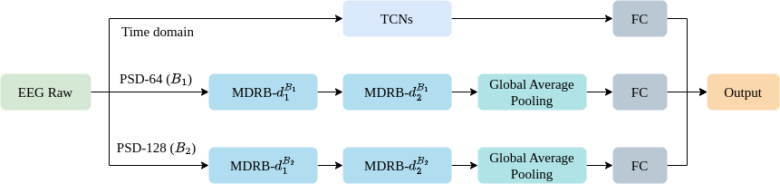

  ### System overview: Combined time and frequency domains for mental workload estimation.

  

  ### Overview of converting EEG signals to a 3D representation.

  

  ### Multi-Dimensional Residual Block.

  

  The human brain is continuously active while the human is working or resting. Human mental activity is a daily process. If the human brain works excessively, called overload, human health will be affected. Recently, mental health can be predicted early, which is to avoid serious health consequences and improve quality of life. Therefore, mental status estimation has received the attention of many different researchers due to its benefits. There are many kinds of signals used to assess mental state, but the electroencephalogram contains a lot of information about the brain and is widely used by researchers. In this paper, we classify mental workload into three states (low, middle, and high) and estimate continuum levels of mental workload. Our method combines information of multiple space dimensions to get the best results for mental estimation. Temporal Convolutional Networks is applied for the time domain approach. For the frequency domain, we have proposed a new architecture based on combining residual blocks, called the Multi-Dimensional Residual Block.

**Input:** Window size 512 Hz (4s) with 14 channels.

**Output:** Depend on the label of input. There are two models, such as:
  > Classification (low, middle, and high).

  > Regression (range [0, 1]).

**Results:** The paper was submitted to IEEE Access:
> (1) **Hong-Hai Nguyen**, Ngumimi Karen Iyortsuun, Hyung-Jeong Yang, Guee-Sang Lee, and Soo-Hyung Kim, "Mental Workload Estimation with Electroencephalogram Signals by Combining Multi-Space Deep Models" IEEE Access.

  ### Demo
  
  
