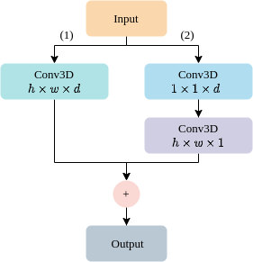

  ### System overview: Combined time and frequency domains for mental workload estimation.

  

  ### Overview of converting EEG signals to a 3D representation.

  

  ### Multi-Dimensional Residual Block.

  

ABSTRACT
The human brain is perpetually active, operating during both work and rest. Excessive mental activity, termed overload, can detrimentally impact health. Advances in predicting mental health conditions aim to prevent severe consequences and improve overall well-being. Consequently, mental status estimation has gained considerable research attention due to its potential benefits. Among the various signals used to assess mental state, the electroencephalogram, with its wealth of brain-related information, is widely employed by researchers. In this paper, we categorize mental workload into three states (low, middle, and high) and estimate a continuum of mental workload levels. Our method leverages information from multiple spatial dimensions (time and frequency domain) to achieve optimal results. In our approach, focusing on the time domain, we utilize Temporal Convolutional Networks to capture temporal information. Meanwhile, in the frequency domain, we implement two distinct branches aimed at acquiring varied information regarding Power Spectral Density by utilizing different lengths of the Fast Fourier Transform. Each branch consists of two blocks, known as the Multi-Dimensional Residual Block, representing a novel architecture by combining residual blocks. The integration of these two domains yields significant results compared to individual estimates in each domain. Our approach achieved a 74.98% accuracy in the three-class classification, surpassing the provided data results at 69.00%. Specially, our method demonstrates efficacy in estimating continuous levels, evidenced by a corresponding Concordance Correlation Coefficient result of 0.629. The combination of time and frequency domain analysis in our approach highlights the exciting potential to improve healthcare applications in the future.

**Input:** Window size 512 Hz (4s) with 14 channels.

**Output:** Depend on the label of input. There are two models, such as:
  > Classification (low, middle, and high).

  > Regression (range [0, 1]).

**Results:** The paper was accepted:
> (1) **Hong-Hai Nguyen**, Ngumimi Karen Iyortsuun, Seungwon Kim, Hyung-Jeong Yang, and Soo-Hyung Kim, "Mental Workload Estimation with Electroencephalogram Signals by Combining Multi-Space Deep Models", Biomedical Signal Processing and Control, Aug 2024, 94, 106284 (IF: 5.1, JCR Q2) (BRL3/AI융합대학원)

  ### Demo
  
  
