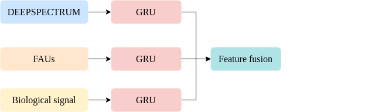
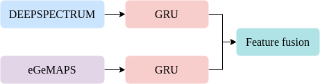
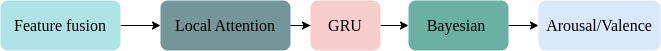

---
title: Stress Estimation
summary: Sentiment analysis is an aspect momentous for application in the future. Especially, emotional stress estimation helps improve our life. 
    
tags:
  - Computer Vision
date: 2021-009-01
external_link: ''
--- 

  Sentiment analysis is an aspect momentous for application in the future. Especially, emotional stress estimation helps improve our life. In this paper, we solved the problem of stress sub-challenge of Multimodal Sentiment Analysis 2022 (MuSe2022). The aim of the stress task is to predict continuous levels of arousal and valence in continuous times based on audio, video, text and biological signals. In this work, we conducted two steps: feature late fusion and stress estimation. First, various features are provided by the sub-challenge. So we take the strategy of combining features to extract feature fusion. We combined DEEPSPECTRUM and eGeMAPS for arousal; DEEPSPECTRUM, FAUS and Physiological signals for valence by Gated Recurrent Unit (GRU) for multimodal fusion. Second, the valence and arousal prediction were based on combining three ingredients such as Local Attention, GRU, and Bayesian NetWork. The
Concordance Correlation Coefficient (CCC) loss function was applied during model training. Our method achieved the good CCC performance of 0.640 on a combination of valence and arousal on the challenge of the development set, which outperforms the baseline method with a corresponding CCC of 0.618 (Audio and Video) on a combination of arousal and valence.

### Feature late fusion for Valence.

### Feature late fusion for Arousal.

###  An overview of valence/arousal prediction system.

